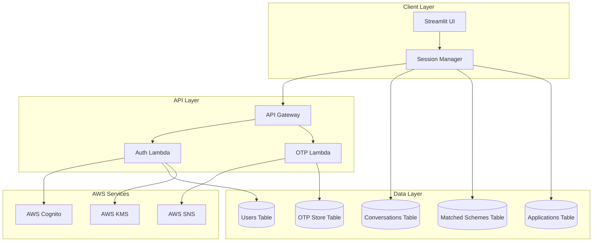
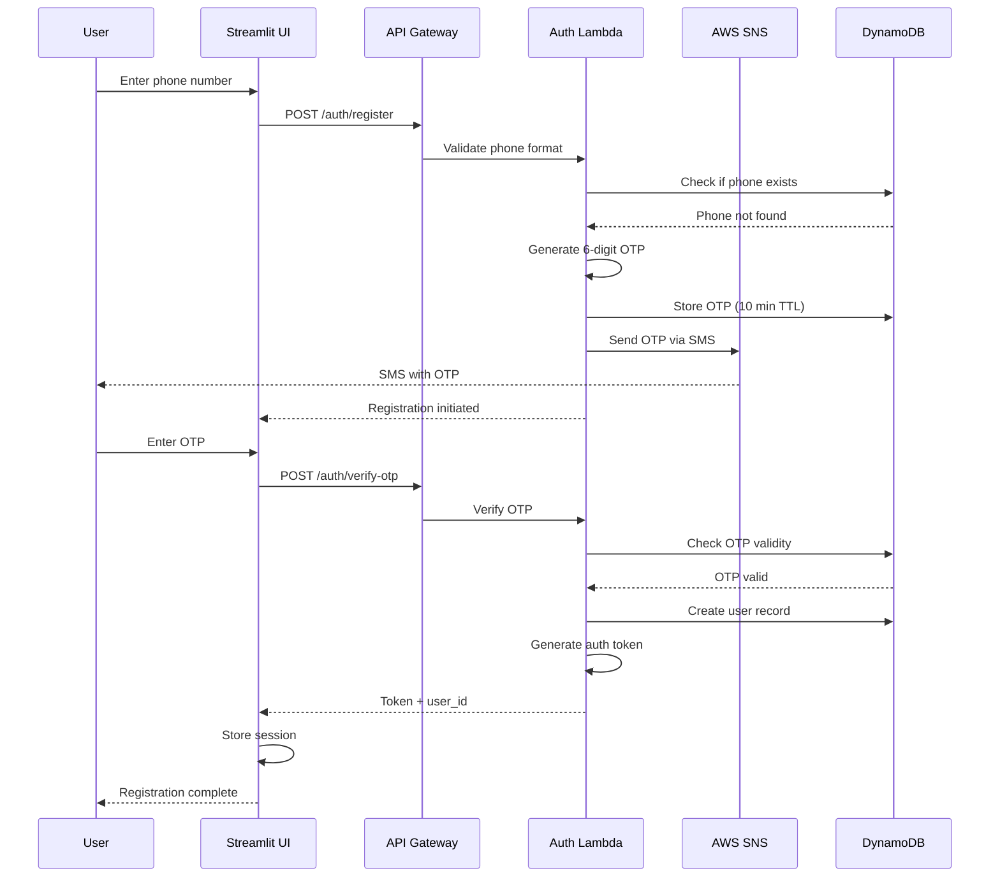
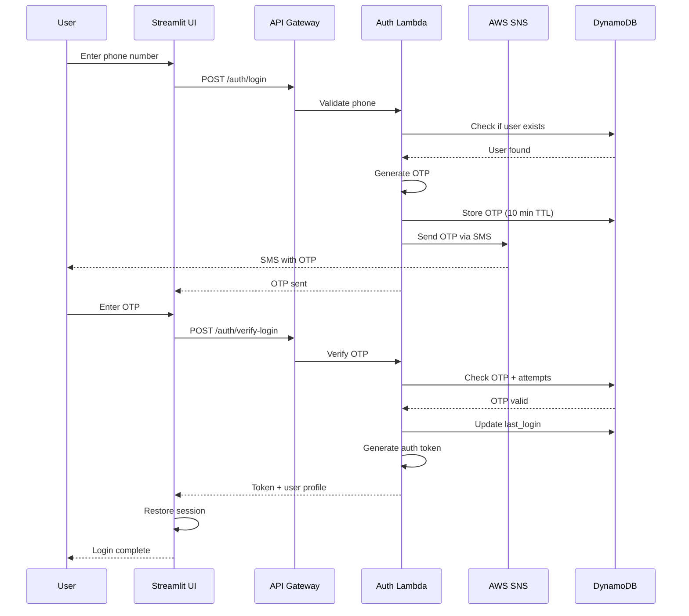

# Design Document: User Authentication and Login System

## Overview

This design document specifies the technical architecture for adding phone number-based OTP authentication to YojnaMitra-AI. The system will enable secure user registration, login, session management, and persistent data storage for user profiles, conversation history, matched schemes, and application tracking.

### Design Goals

- Implement secure phone-based OTP authentication optimized for Indian mobile users
- Integrate seamlessly with existing Streamlit application without disrupting user experience
- Provide persistent storage for user data across sessions
- Ensure scalability and security using AWS managed services
- Maintain low latency for authentication operations (<2 seconds for OTP delivery)
- Support both Hindi and English language interfaces

### Technology Stack

- **Frontend**: Streamlit (existing application)
- **Authentication**: AWS Cognito with custom SMS authentication flow
- **OTP Delivery**: AWS SNS (Simple Notification Service)
- **Backend**: AWS Lambda (Python 3.11)
- **API Layer**: AWS API Gateway
- **Database**: AWS DynamoDB
- **Session Storage**: Streamlit session state + DynamoDB
- **Security**: AWS KMS for encryption, HTTPS/TLS for transport
- **Region**: ap-south-1 (Mumbai) for optimal latency

## Architecture

### High-Level Architecture




### Authentication Flow Diagrams

#### Registration Flow



#### Login Flow



### System Components

#### 1. Frontend Layer (Streamlit)
- **Login Page**: Phone number input, OTP verification
- **Registration Page**: New user onboarding with OTP
- **Session Manager**: Maintains authenticated state
- **Dashboard**: User-specific data display after authentication

#### 2. API Layer
- **API Gateway**: RESTful endpoints with API key authentication
- **Lambda Functions**: Serverless compute for auth operations
- **Rate Limiting**: Throttling to prevent abuse

#### 3. Authentication Service
- **OTP Generation**: Cryptographically secure 6-digit codes
- **OTP Validation**: Time-based expiration and attempt tracking
- **Token Management**: JWT-based session tokens
- **Account Security**: Lockout mechanisms for failed attempts

#### 4. Data Storage
- **DynamoDB Tables**: NoSQL storage for user data
- **Session Persistence**: Cross-device session continuity
- **Data Encryption**: At-rest and in-transit encryption

## Components and Interfaces

### Frontend Components

#### 1. Authentication UI Components

**LoginPage Component**
```python
class LoginPage:
    """Handles user login interface"""
    
    def render(self):
        """Display login form with phone input and OTP verification"""
        - Phone number input (10 digits)
        - OTP input field (6 digits)
        - Resend OTP button (30s cooldown)
        - Error message display
        - Link to registration page
    
    def validate_phone(self, phone: str) -> bool:
        """Validate Indian phone number format"""
        - Check 10-digit format
        - Validate against Indian numbering plan
        - Return validation result
    
    def submit_phone(self, phone: str) -> dict:
        """Submit phone for OTP generation"""
        - Call API: POST /auth/login
        - Handle response
        - Display OTP input field
    
    def verify_otp(self, phone: str, otp: str) -> dict:
        """Verify OTP and complete login"""
        - Call API: POST /auth/verify-login
        - Store auth token
        - Redirect to dashboard
```

**RegistrationPage Component**
```python
class RegistrationPage:
    """Handles new user registration"""
    
    def render(self):
        """Display registration form"""
        - Phone number input
        - OTP verification
        - Terms acceptance checkbox
        - Submit button
    
    def check_existing_user(self, phone: str) -> bool:
        """Check if phone already registered"""
        - Call API: GET /auth/check-phone
        - Return existence status
    
    def register_user(self, phone: str, otp: str) -> dict:
        """Complete registration after OTP verification"""
        - Call API: POST /auth/register
        - Create user session
        - Redirect to profile setup
```

**SessionManager Component**
```python
class SessionManager:
    """Manages user session state"""
    
    def __init__(self):
        self.session_key = "yojnamitra_auth_token"
        self.user_key = "yojnamitra_user_id"
    
    def create_session(self, token: str, user_id: str, user_data: dict):
        """Create authenticated session"""
        - Store token in st.session_state
        - Store user_id and profile data
        - Set session expiry (24 hours)
    
    def validate_session(self) -> bool:
        """Check if current session is valid"""
        - Verify token exists
        - Check expiration time
        - Validate with backend if needed
    
    def get_user_id(self) -> str:
        """Retrieve current user ID"""
        - Return user_id from session
    
    def clear_session(self):
        """Clear session data on logout"""
        - Remove token
        - Clear user data
        - Reset session state
    
    def refresh_token(self) -> bool:
        """Refresh authentication token"""
        - Call API: POST /auth/refresh
        - Update stored token
```

### Backend Components

#### 2. Lambda Functions

**AuthenticationLambda**
```python
def lambda_handler_auth(event, context):
    """
    Main authentication handler
    Routes: /auth/register, /auth/login, /auth/verify-otp, /auth/verify-login
    """
    
    route = event['path']
    method = event['httpMethod']
    body = json.loads(event['body'])
    
    if route == '/auth/register' and method == 'POST':
        return handle_registration(body)
    elif route == '/auth/login' and method == 'POST':
        return handle_login(body)
    elif route == '/auth/verify-otp' and method == 'POST':
        return handle_verify_registration(body)
    elif route == '/auth/verify-login' and method == 'POST':
        return handle_verify_login(body)
    elif route == '/auth/logout' and method == 'POST':
        return handle_logout(body)
    elif route == '/auth/refresh' and method == 'POST':
        return handle_token_refresh(body)

def handle_registration(body: dict) -> dict:
    """Process registration request"""
    phone = body['phone']
    
    # Validate phone format
    if not validate_phone_format(phone):
        return error_response(400, "Invalid phone format")
    
    # Check if user exists
    if user_exists(phone):
        return error_response(409, "Account already exists")
    
    # Generate OTP
    otp = generate_otp()
    otp_hash = hash_otp(otp)
    
    # Store OTP with expiration
    store_otp(phone, otp_hash, expiry_minutes=10)
    
    # Send OTP via SNS
    send_otp_sms(phone, otp)
    
    return success_response({"message": "OTP sent", "expires_in": 600})

def handle_verify_registration(body: dict) -> dict:
    """Verify OTP and create user account"""
    phone = body['phone']
    otp = body['otp']
    
    # Verify OTP
    if not verify_otp(phone, otp):
        increment_failed_attempts(phone)
        attempts_left = 3 - get_failed_attempts(phone)
        
        if attempts_left <= 0:
            invalidate_otp(phone)
            return error_response(429, "Too many failed attempts")
        
        return error_response(401, f"Invalid OTP. {attempts_left} attempts left")
    
    # Create user record
    user_id = generate_user_id()
    create_user(user_id, phone)
    
    # Generate auth token
    token = generate_auth_token(user_id)
    
    # Clear OTP
    delete_otp(phone)
    
    return success_response({
        "token": token,
        "user_id": user_id,
        "expires_in": 86400
    })
```

**OTPLambda**
```python
def lambda_handler_otp(event, context):
    """
    OTP management handler
    Routes: /auth/resend-otp, /auth/validate-otp
    """
    
    route = event['path']
    body = json.loads(event['body'])
    
    if route == '/auth/resend-otp':
        return handle_resend_otp(body)

def handle_resend_otp(body: dict) -> dict:
    """Resend OTP with cooldown enforcement"""
    phone = body['phone']
    
    # Check cooldown period
    last_sent = get_last_otp_time(phone)
    if last_sent and (datetime.now() - last_sent).seconds < 30:
        remaining = 30 - (datetime.now() - last_sent).seconds
        return error_response(429, f"Wait {remaining}s before resending")
    
    # Check hourly limit
    resend_count = get_resend_count(phone)
    if resend_count >= 3:
        return error_response(429, "Hourly resend limit exceeded")
    
    # Invalidate previous OTP
    invalidate_otp(phone)
    
    # Generate new OTP
    otp = generate_otp()
    otp_hash = hash_otp(otp)
    
    # Store new OTP
    store_otp(phone, otp_hash, expiry_minutes=10)
    increment_resend_count(phone)
    
    # Send via SNS
    send_otp_sms(phone, otp)
    
    return success_response({"message": "OTP resent", "expires_in": 600})
```

### API Interfaces

#### Authentication Endpoints

**POST /auth/register**
```json
Request:
{
  "phone": "9876543210"
}

Response (200):
{
  "status": "success",
  "message": "OTP sent to your phone",
  "expires_in": 600,
  "request_id": "uuid"
}

Response (409):
{
  "status": "error",
  "error": "Account already exists",
  "code": "USER_EXISTS"
}
```

**POST /auth/verify-otp**
```json
Request:
{
  "phone": "9876543210",
  "otp": "123456"
}

Response (200):
{
  "status": "success",
  "token": "eyJhbGciOiJIUzI1NiIsInR5cCI6IkpXVCJ9...",
  "user_id": "usr_abc123",
  "expires_in": 86400
}

Response (401):
{
  "status": "error",
  "error": "Invalid OTP",
  "attempts_remaining": 2
}
```

**POST /auth/login**
```json
Request:
{
  "phone": "9876543210"
}

Response (200):
{
  "status": "success",
  "message": "OTP sent",
  "expires_in": 600
}

Response (404):
{
  "status": "error",
  "error": "Account not found",
  "code": "USER_NOT_FOUND"
}
```

**POST /auth/verify-login**
```json
Request:
{
  "phone": "9876543210",
  "otp": "123456"
}

Response (200):
{
  "status": "success",
  "token": "eyJhbGciOiJIUzI1NiIsInR5cCI6IkpXVCJ9...",
  "user_id": "usr_abc123",
  "user_profile": {
    "name": "Rajesh Kumar",
    "phone": "9876543210",
    "state": "Bihar",
    "created_at": "2024-01-15T10:30:00Z"
  },
  "expires_in": 86400
}

Response (429):
{
  "status": "error",
  "error": "Account temporarily locked",
  "unlock_at": "2024-01-15T11:00:00Z",
  "code": "ACCOUNT_LOCKED"
}
```

**POST /auth/resend-otp**
```json
Request:
{
  "phone": "9876543210"
}

Response (200):
{
  "status": "success",
  "message": "OTP resent",
  "expires_in": 600
}

Response (429):
{
  "status": "error",
  "error": "Please wait before requesting another OTP",
  "retry_after": 25,
  "code": "RATE_LIMITED"
}
```

**POST /auth/logout**
```json
Request:
{
  "token": "eyJhbGciOiJIUzI1NiIsInR5cCI6IkpXVCJ9...",
  "user_id": "usr_abc123"
}

Response (200):
{
  "status": "success",
  "message": "Logged out successfully"
}
```

**POST /auth/refresh**
```json
Request:
{
  "token": "eyJhbGciOiJIUzI1NiIsInR5cCI6IkpXVCJ9...",
  "user_id": "usr_abc123"
}

Response (200):
{
  "status": "success",
  "token": "eyJhbGciOiJIUzI1NiIsInR5cCI6IkpXVCJ9...",
  "expires_in": 86400
}
```

## Data Models

### DynamoDB Table Schemas

#### Users Table

**Table Name**: `YojnaMitra-Users-Auth`

**Primary Key**: 
- Partition Key: `user_id` (String)

**Attributes**:
```python
{
    "user_id": "usr_abc123",  # UUID
    "phone_number_encrypted": "encrypted_phone_data",  # Encrypted with KMS
    "phone_hash": "sha256_hash",  # For lookups
    "created_at": "2024-01-15T10:30:00Z",
    "last_login": "2024-01-20T14:22:00Z",
    "login_count": 42,
    "profile": {
        "name": "Rajesh Kumar",
        "age": 35,
        "state": "Bihar",
        "district": "Patna",
        "income": 300000,
        "occupation": "Farmer",
        "category": "General",
        "gender": "Male",
        "preferred_language": "hi"
    },
    "account_status": "active",  # active, locked, suspended
    "lock_until": null,  # ISO timestamp if locked
    "security": {
        "failed_login_attempts": 0,
        "last_failed_login": null,
        "password_reset_required": false
    }
}
```

**Global Secondary Indexes**:
- `phone_hash-index`: For phone number lookups
  - Partition Key: `phone_hash`

#### OTP Store Table

**Table Name**: `YojnaMitra-OTP-Store`

**Primary Key**:
- Partition Key: `phone_hash` (String)

**Attributes**:
```python
{
    "phone_hash": "sha256_hash",
    "otp_hash": "bcrypt_hash",  # Hashed OTP
    "created_at": "2024-01-20T14:20:00Z",
    "expires_at": "2024-01-20T14:30:00Z",
    "ttl": 1705761000,  # Unix timestamp for DynamoDB TTL
    "attempts": 0,
    "max_attempts": 3,
    "invalidated": false,
    "otp_type": "registration",  # registration, login
    "resend_count": 0,
    "last_resend": null
}
```

**TTL Configuration**: `ttl` attribute (auto-delete after expiration)

#### Conversations Table

**Table Name**: `YojnaMitra-Conversations`

**Primary Key**:
- Partition Key: `user_id` (String)
- Sort Key: `timestamp` (Number)

**Attributes**:
```python
{
    "user_id": "usr_abc123",
    "timestamp": 1705761234567,  # Unix timestamp in milliseconds
    "conversation_id": "conv_xyz789",
    "message_type": "user",  # user, assistant
    "message_text": "I am a farmer from Bihar",
    "message_metadata": {
        "extracted_info": {
            "occupation": "farmer",
            "state": "Bihar"
        },
        "intent": "profile_collection"
    },
    "ttl": 1713537234  # 90 days from creation
}
```

**Global Secondary Indexes**:
- `conversation_id-index`: For retrieving full conversations
  - Partition Key: `conversation_id`
  - Sort Key: `timestamp`

#### Matched Schemes Table

**Table Name**: `YojnaMitra-Matched-Schemes`

**Primary Key**:
- Partition Key: `user_id` (String)
- Sort Key: `scheme_id` (String)

**Attributes**:
```python
{
    "user_id": "usr_abc123",
    "scheme_id": "scheme_pmkisan_001",
    "match_timestamp": "2024-01-20T14:25:00Z",
    "match_score": 95,
    "scheme_details": {
        "name": "PM-KISAN",
        "full_name": "Pradhan Mantri Kisan Samman Nidhi",
        "benefit": "Rs.6,000 per year",
        "category": "Agriculture",
        "state": "All India"
    },
    "eligibility_matched": [
        "occupation: farmer",
        "land_ownership: yes",
        "age: 18-100"
    ],
    "user_profile_snapshot": {
        "age": 35,
        "state": "Bihar",
        "occupation": "Farmer",
        "income": 300000
    },
    "saved": true,
    "saved_at": "2024-01-20T14:26:00Z"
}
```

**Global Secondary Indexes**:
- `scheme_id-index`: For scheme-based queries
  - Partition Key: `scheme_id`

#### Applications Table

**Table Name**: `YojnaMitra-Applications`

**Primary Key**:
- Partition Key: `user_id` (String)
- Sort Key: `application_id` (String)

**Attributes**:
```python
{
    "user_id": "usr_abc123",
    "application_id": "app_def456",
    "scheme_id": "scheme_pmkisan_001",
    "scheme_name": "PM-KISAN",
    "status": "documents_pending",  # interested, documents_pending, submitted, under_review, approved, rejected
    "created_at": "2024-01-20T14:30:00Z",
    "updated_at": "2024-01-21T10:15:00Z",
    "status_history": [
        {
            "status": "interested",
            "timestamp": "2024-01-20T14:30:00Z",
            "note": "User expressed interest"
        },
        {
            "status": "documents_pending",
            "timestamp": "2024-01-21T10:15:00Z",
            "note": "Aadhaar card uploaded"
        }
    ],
    "documents": {
        "aadhaar": {
            "uploaded": true,
            "s3_key": "documents/usr_abc123/aadhaar.pdf",
            "uploaded_at": "2024-01-21T10:15:00Z"
        },
        "bank_account": {
            "uploaded": false,
            "required": true
        }
    },
    "notifications_sent": 2,
    "last_notification": "2024-01-22T09:00:00Z"
}
```

**Global Secondary Indexes**:
- `status-index`: For filtering by status
  - Partition Key: `status`
  - Sort Key: `updated_at`

#### Auth Tokens Table

**Table Name**: `YojnaMitra-Auth-Tokens`

**Primary Key**:
- Partition Key: `token_hash` (String)

**Attributes**:
```python
{
    "token_hash": "sha256_hash",
    "user_id": "usr_abc123",
    "created_at": "2024-01-20T14:25:00Z",
    "expires_at": "2024-01-21T14:25:00Z",
    "ttl": 1705848300,  # Unix timestamp for auto-deletion
    "device_info": {
        "user_agent": "Mozilla/5.0...",
        "ip_address": "103.x.x.x"
    },
    "invalidated": false,
    "last_used": "2024-01-20T15:30:00Z"
}
```

**TTL Configuration**: `ttl` attribute (24-hour expiration)

### Security Considerations

#### Encryption Strategy

**At-Rest Encryption**:
- All DynamoDB tables encrypted with AWS KMS
- Phone numbers encrypted before storage
- OTPs hashed using bcrypt (cost factor: 12)
- Auth tokens hashed using SHA-256

**In-Transit Encryption**:
- All API calls over HTTPS/TLS 1.3
- Certificate pinning for mobile apps (future)

**Key Management**:
- AWS KMS Customer Managed Key (CMK) for phone encryption
- Key rotation enabled (annual)
- Separate keys for different environments (dev/prod)

#### Data Privacy

**PII Handling**:
- Phone numbers: Encrypted + hashed for lookups
- User profiles: Encrypted at rest
- Conversation history: 90-day retention with auto-deletion
- Right to deletion: User can request account deletion

**Compliance**:
- GDPR-compliant data handling
- Indian data localization (ap-south-1 region)
- Audit logging for all authentication events


## Correctness Properties

*A property is a characteristic or behavior that should hold true across all valid executions of a system—essentially, a formal statement about what the system should do. Properties serve as the bridge between human-readable specifications and machine-verifiable correctness guarantees.*

### Property Reflection

After analyzing all acceptance criteria, I identified the following redundancies and consolidations:

**Redundancies Eliminated**:
- Properties 1.1 and 1.2 (phone validation) → Combined into Property 1
- Properties 1.3 and 1.4 (duplicate detection) → Combined into Property 2
- Properties 2.2 and 4.2 (OTP verification) → Combined into Property 4
- Properties 2.3 and 4.3 (expiration checking) → Combined into Property 5
- Properties 2.4 and 4.4 (failed attempts) → Combined into Property 6
- Properties 2.7, 4.7 (token generation) → Combined into Property 8
- Properties 2.8, 4.8 (session creation) → Combined into Property 9
- Properties 1.5, 3.4, 15.1 (OTP format) → Combined into Property 3
- Properties 1.7, 3.6 (OTP expiration) → Combined into Property 7
- Properties 6.1 and 6.2 (conversation persistence) → Combined into Property 18
- Properties 12.3 and 12.4 (cooldown enforcement) → Combined into Property 29
- Properties 12.6 and 12.7 (hourly rate limiting) → Combined into Property 30

**Properties Retained**:
Each remaining property provides unique validation value and tests a distinct aspect of the system.

### Property 1: Phone Number Validation

*For any* string input submitted as a phone number, the Authentication_Service should accept it only if it matches the 10-digit Indian mobile number format (starting with 6-9).

**Validates: Requirements 1.1, 1.2, 3.1**

### Property 2: Duplicate Registration Prevention

*For any* phone number that already exists in the User_Profile_Store, attempting to register with that phone number should return an error indicating the account already exists.

**Validates: Requirements 1.3, 1.4**

### Property 3: OTP Format Consistency

*For any* OTP generation operation (registration or login), the generated OTP should be exactly 6 numeric digits.

**Validates: Requirements 1.5, 3.4, 15.1**

### Property 4: OTP Verification Correctness

*For any* OTP verification attempt, the system should accept the OTP only if it matches the stored hashed value for that phone number.

**Validates: Requirements 2.2, 4.2**

### Property 5: OTP Expiration Enforcement

*For any* OTP that has exceeded its 10-minute validity period, verification attempts should fail with an expiration error.

**Validates: Requirements 1.7, 2.3, 3.6, 4.3**

### Property 6: Failed Attempt Tracking

*For any* incorrect OTP submission, the system should increment the failed attempt counter and return the number of remaining attempts.

**Validates: Requirements 2.4, 4.4**

### Property 7: OTP Storage with Expiration

*For any* OTP generation, the stored OTP record should include an expiration timestamp set to exactly 10 minutes from creation.

**Validates: Requirements 1.7, 3.6**

### Property 8: Token Generation on Success

*For any* successful authentication (registration or login), the system should generate a cryptographically secure authentication token.

**Validates: Requirements 2.7, 4.7, 11.4**

### Property 9: Session Creation on Authentication

*For any* generated authentication token, the Session_Manager should create a session with a 24-hour validity period.

**Validates: Requirements 2.8, 4.8, 9.1**

### Property 10: User Existence Validation for Login

*For any* login attempt with a phone number that does not exist in the User_Profile_Store, the system should return an error indicating no account found.

**Validates: Requirements 3.2, 3.3**

### Property 11: User Profile Retrieval on Login

*For any* successful login OTP verification, the system should retrieve and return the complete user profile from the User_Profile_Store.

**Validates: Requirements 4.6, 4.9**

### Property 12: User Record Creation with Required Fields

*For any* successful registration, the created user record should contain all required fields: user_id, phone_number (encrypted), creation_timestamp, and last_login_timestamp.

**Validates: Requirements 2.6, 5.1**

### Property 13: Last Login Timestamp Update

*For any* successful login, the user's last_login_timestamp should be updated to the current time.

**Validates: Requirements 5.2**

### Property 14: Profile Update Persistence

*For any* profile update operation, immediately retrieving the profile should return the updated values.

**Validates: Requirements 5.3, 5.4**

### Property 15: Profile Retrieval on Dashboard Access

*For any* authenticated user accessing the dashboard, the system should retrieve and display their complete profile from the User_Profile_Store.

**Validates: Requirements 5.5**

### Property 16: API Response Format Consistency

*For any* successful OTP generation (registration or login), the API response should include status, message, and expires_in fields.

**Validates: Requirements 1.8, 3.7**

### Property 17: Registration Response Completeness

*For any* successful registration, the API response should include the authentication token, user_id, and expiration time.

**Validates: Requirements 2.9**

### Property 18: Conversation Message Persistence

*For any* message sent by a user or AI assistant, the Conversation_Store should save it with all required fields: user_id, timestamp, message_text, and message_type.

**Validates: Requirements 6.1, 6.2**

### Property 19: Conversation History Retrieval

*For any* authenticated user opening the application, the system should retrieve their complete conversation history from the Conversation_Store.

**Validates: Requirements 6.3**

### Property 20: Conversation Chronological Ordering

*For any* conversation history retrieval, the messages should be ordered chronologically by timestamp in ascending order.

**Validates: Requirements 6.4**

### Property 21: Conversation History Time Window

*For any* conversation history retrieval, only messages from the past 90 days should be included in the results.

**Validates: Requirements 6.5**

### Property 22: Matched Scheme Persistence

*For any* scheme match identified by the AI assistant, the Scheme_Store should save it with all required fields: user_id, scheme_id, match_timestamp, match_score, scheme_details, and eligibility_matched.

**Validates: Requirements 7.1, 7.4**

### Property 23: Matched Scheme Retrieval

*For any* authenticated user viewing matched schemes, the system should retrieve all schemes associated with that user_id from the Scheme_Store.

**Validates: Requirements 7.2**

### Property 24: Duplicate Scheme Prevention

*For any* attempt to save a scheme with a user_id and scheme_id combination that already exists, the system should prevent the duplicate entry.

**Validates: Requirements 7.3**

### Property 25: Matched Scheme Sorting

*For any* matched scheme display, the schemes should be sorted by match_score in descending order (highest score first).

**Validates: Requirements 7.5**

### Property 26: Application Record Creation

*For any* user indicating intent to apply for a scheme, the Application_Store should create a record with all required fields: user_id, scheme_id, status, created_timestamp, and updated_timestamp.

**Validates: Requirements 8.1**

### Property 27: Application Status Validation

*For any* application status update, the new status should be one of the valid values: "interested", "documents_pending", "submitted", "under_review", "approved", or "rejected".

**Validates: Requirements 8.2**

### Property 28: Application Status Update

*For any* application status change, both the status field and updated_timestamp should be updated, and the change should be recorded in status_history.

**Validates: Requirements 8.3, 8.7**

### Property 29: OTP Resend Cooldown Enforcement

*For any* OTP resend request made within 30 seconds of the previous request, the system should reject it and return an error with the remaining wait time.

**Validates: Requirements 12.2, 12.3, 12.4**

### Property 30: OTP Resend Hourly Rate Limit

*For any* phone number that has requested OTP resend 3 times within an hour, the 4th resend request should be blocked for 1 hour.

**Validates: Requirements 12.6, 12.7**

### Property 31: Previous OTP Invalidation on Resend

*For any* successful OTP resend operation, the previously generated OTP for that phone number should be invalidated.

**Validates: Requirements 12.2**

### Property 32: Session Token Validation

*For any* user action requiring authentication, the Session_Manager should validate the authentication token before allowing the action.

**Validates: Requirements 9.3**

### Property 33: Invalid Token Handling

*For any* authentication token that is invalid or expired, the Session_Manager should reject the request and redirect to the login page.

**Validates: Requirements 9.4**

### Property 34: Session Restoration

*For any* user reopening the application with a valid unexpired token, the Session_Manager should restore the authenticated session without requiring re-login.

**Validates: Requirements 9.6**

### Property 35: Session Cleanup on Expiration

*For any* session that has exceeded its 24-hour validity period, the Session_Manager should clear all session data and require re-authentication.

**Validates: Requirements 9.7**

### Property 36: Token Invalidation on Logout

*For any* logout operation, the Session_Manager should invalidate the current authentication token and clear all session data.

**Validates: Requirements 10.2, 10.3**

### Property 37: Logout Timestamp Recording

*For any* logout operation, the system should record the logout timestamp in the user's profile in the User_Profile_Store.

**Validates: Requirements 10.5**

### Property 38: Invalidated Token Rejection

*For any* attempt to use an invalidated authentication token, the Session_Manager should reject the request and require re-authentication.

**Validates: Requirements 10.6**

### Property 39: Phone Number Encryption

*For any* phone number stored in the User_Profile_Store, it should be encrypted using AWS KMS before storage.

**Validates: Requirements 11.2**

### Property 40: OTP Hashing

*For any* OTP stored in the OTP_Store, it should be hashed using bcrypt before storage (never stored in plaintext).

**Validates: Requirements 11.3**

### Property 41: Authentication Audit Logging

*For any* authentication attempt (registration, login, OTP verification), the system should log the event with timestamp, phone_number (hashed), and result.

**Validates: Requirements 11.7**

### Property 42: Error Message Descriptiveness

*For any* authentication error, the API response should include a descriptive error message explaining what went wrong.

**Validates: Requirements 13.1**

### Property 43: Phone Validation Error Message

*For any* invalid phone number format, the error message should specify the correct format (10-digit Indian mobile number).

**Validates: Requirements 13.2**

### Property 44: OTP Error with Remaining Attempts

*For any* incorrect OTP submission, the error message should include the number of remaining attempts before lockout.

**Validates: Requirements 13.3**

### Property 45: Expired OTP Error with Resend Option

*For any* expired OTP submission, the error message should indicate expiration and provide an option to resend.

**Validates: Requirements 13.4**

### Property 46: Account Lock Error with Unlock Time

*For any* login attempt on a temporarily locked account, the error message should include the unlock timestamp.

**Validates: Requirements 13.5**

### Property 47: Error Logging Without PII

*For any* error logged by the Authentication_Service, the log should contain sufficient debugging information without exposing sensitive data (phone numbers should be hashed, OTPs should never be logged).

**Validates: Requirements 13.7**

### Property 48: User ID Propagation

*For any* authenticated request to backend services, the Session_Manager should include the user_id in the request context.

**Validates: Requirements 14.3**

### Property 49: Data Association with User ID

*For any* data generated by the AI assistant for an authenticated user, the data should be associated with the correct user_id.

**Validates: Requirements 14.4**

### Property 50: SMS Message Format

*For any* OTP sent via SMS, the message should follow the format: "Your YojnaMitra-AI verification code is: [OTP]. Valid for 10 minutes. Do not share this code."

**Validates: Requirements 15.2**

### Property 51: OTP Delivery Retry Logic

*For any* failed OTP delivery attempt, the system should retry up to 2 additional times with 10-second intervals between retries.

**Validates: Requirements 15.4**

### Property 52: Complete Delivery Failure Handling

*For any* OTP delivery where all 3 attempts (initial + 2 retries) fail, the system should return an error to the user with an option to retry.

**Validates: Requirements 15.5**

### Property 53: Delivery Status Logging

*For any* OTP delivery attempt (success or failure), the system should log the delivery status for monitoring and debugging.

**Validates: Requirements 15.7**

### Property 54: Application Retrieval by User

*For any* authenticated user viewing their applications, the system should retrieve all application records associated with that user_id.

**Validates: Requirements 8.4**

### Property 55: Application Grouping by Status

*For any* application display, the applications should be grouped by their status value.

**Validates: Requirements 8.5**

### Property 56: Session Token Storage

*For any* active session, the authentication token should be maintained in secure storage (Streamlit session state with httpOnly equivalent protection).

**Validates: Requirements 9.2**


## Error Handling

### Error Categories

#### 1. Validation Errors (400 Bad Request)

**Phone Number Validation**
```python
{
    "status": "error",
    "code": "INVALID_PHONE_FORMAT",
    "message": "Phone number must be a 10-digit Indian mobile number starting with 6-9",
    "field": "phone"
}
```

**OTP Format Validation**
```python
{
    "status": "error",
    "code": "INVALID_OTP_FORMAT",
    "message": "OTP must be exactly 6 digits",
    "field": "otp"
}
```

**Missing Required Fields**
```python
{
    "status": "error",
    "code": "MISSING_REQUIRED_FIELD",
    "message": "Required field 'phone' is missing",
    "field": "phone"
}
```

#### 2. Authentication Errors (401 Unauthorized)

**Invalid OTP**
```python
{
    "status": "error",
    "code": "INVALID_OTP",
    "message": "The OTP you entered is incorrect",
    "attempts_remaining": 2,
    "max_attempts": 3
}
```

**Expired OTP**
```python
{
    "status": "error",
    "code": "OTP_EXPIRED",
    "message": "Your OTP has expired. Please request a new one",
    "expired_at": "2024-01-20T14:30:00Z",
    "resend_available": true
}
```

**Invalid Token**
```python
{
    "status": "error",
    "code": "INVALID_TOKEN",
    "message": "Your session has expired. Please log in again",
    "redirect_to": "/login"
}
```

#### 3. Resource Errors (404 Not Found)

**User Not Found**
```python
{
    "status": "error",
    "code": "USER_NOT_FOUND",
    "message": "No account found with this phone number. Please register first",
    "register_url": "/auth/register"
}
```

**OTP Not Found**
```python
{
    "status": "error",
    "code": "OTP_NOT_FOUND",
    "message": "No OTP request found. Please request a new OTP",
    "resend_available": true
}
```

#### 4. Conflict Errors (409 Conflict)

**User Already Exists**
```python
{
    "status": "error",
    "code": "USER_EXISTS",
    "message": "An account with this phone number already exists. Please log in",
    "login_url": "/auth/login"
}
```

**Duplicate Scheme**
```python
{
    "status": "error",
    "code": "SCHEME_ALREADY_SAVED",
    "message": "This scheme is already in your saved list",
    "scheme_id": "scheme_pmkisan_001"
}
```

#### 5. Rate Limiting Errors (429 Too Many Requests)

**OTP Resend Cooldown**
```python
{
    "status": "error",
    "code": "RESEND_COOLDOWN",
    "message": "Please wait before requesting another OTP",
    "retry_after": 25,
    "retry_at": "2024-01-20T14:25:00Z"
}
```

**Hourly Resend Limit**
```python
{
    "status": "error",
    "code": "RESEND_LIMIT_EXCEEDED",
    "message": "You have exceeded the hourly OTP request limit",
    "retry_after": 3600,
    "retry_at": "2024-01-20T15:20:00Z"
}
```

**Account Temporarily Locked**
```python
{
    "status": "error",
    "code": "ACCOUNT_LOCKED",
    "message": "Your account has been temporarily locked due to multiple failed login attempts",
    "unlock_at": "2024-01-20T15:00:00Z",
    "lock_duration": 1800,
    "reason": "5 failed login attempts"
}
```

**Too Many Failed Attempts**
```python
{
    "status": "error",
    "code": "MAX_ATTEMPTS_EXCEEDED",
    "message": "Maximum OTP verification attempts exceeded. Please request a new OTP",
    "max_attempts": 3,
    "resend_available": true
}
```

#### 6. Server Errors (500 Internal Server Error)

**Database Error**
```python
{
    "status": "error",
    "code": "DATABASE_ERROR",
    "message": "An error occurred while processing your request. Please try again",
    "request_id": "req_abc123",
    "retry": true
}
```

**OTP Delivery Failure**
```python
{
    "status": "error",
    "code": "OTP_DELIVERY_FAILED",
    "message": "Failed to send OTP. Please try again or contact support",
    "request_id": "req_abc123",
    "retry": true,
    "attempts": 3
}
```

**Encryption Error**
```python
{
    "status": "error",
    "code": "ENCRYPTION_ERROR",
    "message": "An error occurred while securing your data. Please try again",
    "request_id": "req_abc123",
    "retry": true
}
```

### Error Handling Strategy

#### Frontend Error Handling

```python
class ErrorHandler:
    """Centralized error handling for Streamlit UI"""
    
    @staticmethod
    def handle_api_error(error_response: dict):
        """Display appropriate error message based on error code"""
        
        code = error_response.get('code')
        message = error_response.get('message')
        
        if code == 'INVALID_PHONE_FORMAT':
            st.error(f"❌ {message}")
            st.info("💡 Example: 9876543210")
        
        elif code == 'INVALID_OTP':
            attempts = error_response.get('attempts_remaining', 0)
            st.error(f"❌ {message}")
            st.warning(f"⚠️ {attempts} attempts remaining")
        
        elif code == 'OTP_EXPIRED':
            st.error(f"❌ {message}")
            if st.button("🔄 Resend OTP"):
                resend_otp()
        
        elif code == 'ACCOUNT_LOCKED':
            unlock_time = error_response.get('unlock_at')
            st.error(f"🔒 {message}")
            st.info(f"⏰ Account will unlock at: {unlock_time}")
        
        elif code == 'RESEND_COOLDOWN':
            retry_after = error_response.get('retry_after', 30)
            st.warning(f"⏳ {message}")
            st.info(f"Please wait {retry_after} seconds")
        
        elif code in ['DATABASE_ERROR', 'OTP_DELIVERY_FAILED']:
            st.error(f"❌ {message}")
            if error_response.get('retry'):
                if st.button("🔄 Retry"):
                    st.rerun()
        
        else:
            st.error(f"❌ {message}")
    
    @staticmethod
    def handle_network_error():
        """Handle network connectivity errors"""
        st.error("🌐 Network error. Please check your internet connection")
        if st.button("🔄 Retry"):
            st.rerun()
    
    @staticmethod
    def handle_timeout_error():
        """Handle request timeout errors"""
        st.error("⏱️ Request timed out. Please try again")
        if st.button("🔄 Retry"):
            st.rerun()
```

#### Backend Error Handling

```python
class AuthenticationError(Exception):
    """Base exception for authentication errors"""
    def __init__(self, code: str, message: str, status_code: int = 400, **kwargs):
        self.code = code
        self.message = message
        self.status_code = status_code
        self.details = kwargs
        super().__init__(message)

class ValidationError(AuthenticationError):
    """Validation error (400)"""
    def __init__(self, code: str, message: str, **kwargs):
        super().__init__(code, message, 400, **kwargs)

class UnauthorizedError(AuthenticationError):
    """Authentication error (401)"""
    def __init__(self, code: str, message: str, **kwargs):
        super().__init__(code, message, 401, **kwargs)

class NotFoundError(AuthenticationError):
    """Resource not found (404)"""
    def __init__(self, code: str, message: str, **kwargs):
        super().__init__(code, message, 404, **kwargs)

class ConflictError(AuthenticationError):
    """Resource conflict (409)"""
    def __init__(self, code: str, message: str, **kwargs):
        super().__init__(code, message, 409, **kwargs)

class RateLimitError(AuthenticationError):
    """Rate limit exceeded (429)"""
    def __init__(self, code: str, message: str, retry_after: int, **kwargs):
        super().__init__(code, message, 429, retry_after=retry_after, **kwargs)

class ServerError(AuthenticationError):
    """Internal server error (500)"""
    def __init__(self, code: str, message: str, **kwargs):
        super().__init__(code, message, 500, **kwargs)

def error_handler(func):
    """Decorator for Lambda error handling"""
    def wrapper(event, context):
        try:
            return func(event, context)
        
        except AuthenticationError as e:
            logger.error(f"Authentication error: {e.code} - {e.message}", 
                        extra={'details': e.details})
            return {
                'statusCode': e.status_code,
                'headers': {
                    'Content-Type': 'application/json',
                    'Access-Control-Allow-Origin': '*'
                },
                'body': json.dumps({
                    'status': 'error',
                    'code': e.code,
                    'message': e.message,
                    **e.details
                })
            }
        
        except Exception as e:
            logger.exception("Unexpected error")
            request_id = context.request_id if context else 'unknown'
            return {
                'statusCode': 500,
                'headers': {
                    'Content-Type': 'application/json',
                    'Access-Control-Allow-Origin': '*'
                },
                'body': json.dumps({
                    'status': 'error',
                    'code': 'INTERNAL_ERROR',
                    'message': 'An unexpected error occurred. Please try again',
                    'request_id': request_id,
                    'retry': True
                })
            }
    
    return wrapper
```

### Retry Strategy

#### Exponential Backoff for API Calls

```python
def retry_with_backoff(func, max_retries=3, base_delay=1):
    """Retry function with exponential backoff"""
    for attempt in range(max_retries):
        try:
            return func()
        except Exception as e:
            if attempt == max_retries - 1:
                raise
            delay = base_delay * (2 ** attempt)
            logger.warning(f"Attempt {attempt + 1} failed, retrying in {delay}s")
            time.sleep(delay)
```

#### Circuit Breaker for External Services

```python
class CircuitBreaker:
    """Circuit breaker for external service calls"""
    
    def __init__(self, failure_threshold=5, timeout=60):
        self.failure_threshold = failure_threshold
        self.timeout = timeout
        self.failures = 0
        self.last_failure_time = None
        self.state = 'closed'  # closed, open, half-open
    
    def call(self, func):
        """Execute function with circuit breaker protection"""
        if self.state == 'open':
            if time.time() - self.last_failure_time > self.timeout:
                self.state = 'half-open'
            else:
                raise ServerError('SERVICE_UNAVAILABLE', 
                                'Service temporarily unavailable')
        
        try:
            result = func()
            if self.state == 'half-open':
                self.state = 'closed'
                self.failures = 0
            return result
        
        except Exception as e:
            self.failures += 1
            self.last_failure_time = time.time()
            
            if self.failures >= self.failure_threshold:
                self.state = 'open'
            
            raise
```

## Testing Strategy

### Dual Testing Approach

The authentication system will use both unit tests and property-based tests for comprehensive coverage:

- **Unit Tests**: Verify specific examples, edge cases, and error conditions
- **Property Tests**: Verify universal properties across all inputs using randomized testing

Both approaches are complementary and necessary. Unit tests catch concrete bugs in specific scenarios, while property tests verify general correctness across a wide range of inputs.

### Property-Based Testing Configuration

**Library Selection**: 
- Python: `hypothesis` (industry-standard PBT library)
- Minimum 100 iterations per property test (due to randomization)
- Each test tagged with reference to design document property

**Tag Format**:
```python
# Feature: user-authentication-login, Property 1: Phone Number Validation
```

### Unit Testing Strategy

Unit tests should focus on:
- Specific examples that demonstrate correct behavior
- Edge cases (empty inputs, boundary values, special characters)
- Error conditions (invalid formats, expired tokens, locked accounts)
- Integration points between components

**Avoid writing too many unit tests** - property-based tests handle covering lots of inputs. Unit tests should be targeted and specific.

### Test Organization

```
tests/
├── unit/
│   ├── test_auth_api.py
│   ├── test_otp_service.py
│   ├── test_session_manager.py
│   ├── test_data_models.py
│   └── test_error_handling.py
├── property/
│   ├── test_phone_validation_properties.py
│   ├── test_otp_properties.py
│   ├── test_session_properties.py
│   ├── test_data_persistence_properties.py
│   └── test_security_properties.py
├── integration/
│   ├── test_registration_flow.py
│   ├── test_login_flow.py
│   └── test_end_to_end.py
└── fixtures/
    ├── mock_dynamodb.py
    ├── mock_sns.py
    └── test_data.py
```

### Property-Based Test Examples

#### Property 1: Phone Number Validation

```python
from hypothesis import given, strategies as st
import pytest

# Feature: user-authentication-login, Property 1: Phone Number Validation
@given(st.text())
def test_phone_validation_accepts_only_valid_indian_numbers(phone_input):
    """
    For any string input, the system should accept it only if it matches
    the 10-digit Indian mobile number format (starting with 6-9).
    """
    result = validate_phone_number(phone_input)
    
    # Valid format: exactly 10 digits, starts with 6-9
    is_valid_format = (
        len(phone_input) == 10 and
        phone_input.isdigit() and
        phone_input[0] in '6789'
    )
    
    assert result == is_valid_format
```

#### Property 3: OTP Format Consistency

```python
from hypothesis import given, strategies as st

# Feature: user-authentication-login, Property 3: OTP Format Consistency
@given(st.text(min_size=10, max_size=10, alphabet=st.characters(whitelist_categories=('Nd',))))
def test_otp_generation_always_produces_6_digits(phone):
    """
    For any OTP generation operation, the generated OTP should be
    exactly 6 numeric digits.
    """
    otp = generate_otp()
    
    assert len(otp) == 6
    assert otp.isdigit()
    assert 0 <= int(otp) <= 999999
```

#### Property 4: OTP Verification Correctness

```python
from hypothesis import given, strategies as st

# Feature: user-authentication-login, Property 4: OTP Verification Correctness
@given(
    phone=st.text(min_size=10, max_size=10, alphabet=st.characters(whitelist_categories=('Nd',))),
    otp=st.text(min_size=6, max_size=6, alphabet=st.characters(whitelist_categories=('Nd',)))
)
def test_otp_verification_matches_stored_value(phone, otp):
    """
    For any OTP verification attempt, the system should accept the OTP
    only if it matches the stored hashed value for that phone number.
    """
    # Store OTP
    otp_hash = hash_otp(otp)
    store_otp(phone, otp_hash)
    
    # Verify correct OTP
    assert verify_otp(phone, otp) == True
    
    # Verify incorrect OTP
    wrong_otp = str((int(otp) + 1) % 1000000).zfill(6)
    assert verify_otp(phone, wrong_otp) == False
```

#### Property 14: Profile Update Persistence (Round Trip)

```python
from hypothesis import given, strategies as st

# Feature: user-authentication-login, Property 14: Profile Update Persistence
@given(
    user_id=st.text(min_size=10, max_size=20),
    profile_updates=st.fixed_dictionaries({
        'name': st.text(min_size=1, max_size=100),
        'age': st.integers(min_value=1, max_value=120),
        'state': st.sampled_from(['Bihar', 'UP', 'Maharashtra', 'Delhi']),
        'income': st.integers(min_value=0, max_value=10000000)
    })
)
def test_profile_updates_persist_immediately(user_id, profile_updates):
    """
    For any profile update operation, immediately retrieving the profile
    should return the updated values (round trip property).
    """
    # Create user
    create_user(user_id, "9876543210")
    
    # Update profile
    update_user_profile(user_id, profile_updates)
    
    # Retrieve profile
    retrieved_profile = get_user_profile(user_id)
    
    # Verify all updates persisted
    for key, value in profile_updates.items():
        assert retrieved_profile[key] == value
```

#### Property 20: Conversation Chronological Ordering

```python
from hypothesis import given, strategies as st
from datetime import datetime, timedelta

# Feature: user-authentication-login, Property 20: Conversation Chronological Ordering
@given(
    user_id=st.text(min_size=10, max_size=20),
    messages=st.lists(
        st.fixed_dictionaries({
            'text': st.text(min_size=1, max_size=500),
            'type': st.sampled_from(['user', 'assistant'])
        }),
        min_size=2,
        max_size=20
    )
)
def test_conversation_history_chronological_order(user_id, messages):
    """
    For any conversation history retrieval, the messages should be
    ordered chronologically by timestamp in ascending order.
    """
    # Save messages with timestamps
    base_time = datetime.now()
    for i, msg in enumerate(messages):
        save_conversation_message(
            user_id=user_id,
            message_text=msg['text'],
            message_type=msg['type'],
            timestamp=base_time + timedelta(seconds=i)
        )
    
    # Retrieve conversation history
    history = get_conversation_history(user_id)
    
    # Verify chronological ordering
    timestamps = [msg['timestamp'] for msg in history]
    assert timestamps == sorted(timestamps)
```

#### Property 29: OTP Resend Cooldown Enforcement

```python
from hypothesis import given, strategies as st
import time

# Feature: user-authentication-login, Property 29: OTP Resend Cooldown Enforcement
@given(phone=st.text(min_size=10, max_size=10, alphabet=st.characters(whitelist_categories=('Nd',))))
def test_otp_resend_cooldown_enforcement(phone):
    """
    For any OTP resend request made within 30 seconds of the previous request,
    the system should reject it and return an error with the remaining wait time.
    """
    # First resend request
    result1 = resend_otp(phone)
    assert result1['status'] == 'success'
    
    # Immediate second request (within cooldown)
    result2 = resend_otp(phone)
    assert result2['status'] == 'error'
    assert result2['code'] == 'RESEND_COOLDOWN'
    assert 'retry_after' in result2
    assert 0 < result2['retry_after'] <= 30
    
    # Wait for cooldown
    time.sleep(31)
    
    # Third request (after cooldown)
    result3 = resend_otp(phone)
    assert result3['status'] == 'success'
```

#### Property 39: Phone Number Encryption

```python
from hypothesis import given, strategies as st

# Feature: user-authentication-login, Property 39: Phone Number Encryption
@given(phone=st.text(min_size=10, max_size=10, alphabet=st.characters(whitelist_categories=('Nd',))))
def test_phone_numbers_encrypted_before_storage(phone):
    """
    For any phone number stored in the User_Profile_Store, it should be
    encrypted using AWS KMS before storage.
    """
    user_id = create_user(user_id="test_user", phone=phone)
    
    # Retrieve raw database record
    raw_record = get_raw_db_record(user_id)
    
    # Verify phone is encrypted (not plaintext)
    assert raw_record['phone_number_encrypted'] != phone
    
    # Verify we can decrypt it
    decrypted_phone = decrypt_phone(raw_record['phone_number_encrypted'])
    assert decrypted_phone == phone
```

### Unit Test Examples

#### Edge Case: Maximum Failed Attempts

```python
def test_account_locks_after_5_failed_login_attempts():
    """
    Edge case: Account should lock for 30 minutes after 5 failed login attempts.
    Validates: Requirements 4.5
    """
    phone = "9876543210"
    create_user("test_user", phone)
    
    # Generate OTP
    request_login_otp(phone)
    
    # Make 5 failed attempts
    for i in range(5):
        result = verify_login_otp(phone, "000000")  # Wrong OTP
        assert result['status'] == 'error'
    
    # 6th attempt should indicate account locked
    result = verify_login_otp(phone, "000000")
    assert result['code'] == 'ACCOUNT_LOCKED'
    assert 'unlock_at' in result
    
    # Verify unlock time is ~30 minutes from now
    unlock_time = datetime.fromisoformat(result['unlock_at'])
    expected_unlock = datetime.now() + timedelta(minutes=30)
    assert abs((unlock_time - expected_unlock).total_seconds()) < 60
```

#### Edge Case: OTP Expiration

```python
def test_otp_expires_after_10_minutes():
    """
    Edge case: OTP should expire exactly 10 minutes after generation.
    Validates: Requirements 2.3, 4.3
    """
    phone = "9876543210"
    
    # Generate OTP
    otp = generate_otp()
    store_otp(phone, hash_otp(otp), expiry_minutes=10)
    
    # Verify OTP is valid immediately
    assert verify_otp(phone, otp) == True
    
    # Mock time passage (10 minutes + 1 second)
    with freeze_time(datetime.now() + timedelta(minutes=10, seconds=1)):
        result = verify_otp(phone, otp)
        assert result == False
```

#### Integration Test: Complete Registration Flow

```python
def test_complete_registration_flow():
    """
    Integration test: Complete registration from phone submission to authenticated session.
    Validates: Requirements 1.*, 2.*
    """
    phone = "9876543210"
    
    # Step 1: Submit phone for registration
    response = api_post('/auth/register', {'phone': phone})
    assert response['status'] == 'success'
    assert 'expires_in' in response
    
    # Step 2: Get OTP from mock SNS
    otp = get_last_sent_otp(phone)
    assert len(otp) == 6
    
    # Step 3: Verify OTP
    response = api_post('/auth/verify-otp', {'phone': phone, 'otp': otp})
    assert response['status'] == 'success'
    assert 'token' in response
    assert 'user_id' in response
    
    # Step 4: Verify user created in database
    user = get_user_by_phone(phone)
    assert user is not None
    assert user['phone_hash'] == hash_phone(phone)
    
    # Step 5: Verify session created
    token = response['token']
    session = get_session_by_token(token)
    assert session is not None
    assert session['user_id'] == response['user_id']
```

### Test Coverage Goals

- **Unit Tests**: 80% code coverage minimum
- **Property Tests**: All 56 correctness properties implemented
- **Integration Tests**: All critical user flows covered
- **End-to-End Tests**: Registration, login, logout flows

### Continuous Testing

- Run unit tests on every commit
- Run property tests (100 iterations) on every PR
- Run integration tests before deployment
- Run extended property tests (1000 iterations) nightly

### Performance Testing

- OTP delivery latency: <5 seconds (p95)
- API response time: <500ms (p95)
- Database query time: <100ms (p95)
- Session validation: <50ms (p95)


## Implementation Details

### Phase 1: Infrastructure Setup

#### 1.1 DynamoDB Tables Creation

Update CloudFormation template to add authentication tables:

```yaml
# Add to cloudformation_template.yaml

  UsersAuthTable:
    Type: AWS::DynamoDB::Table
    Properties:
      TableName: !Sub YojnaMitra-Users-Auth-${Environment}
      BillingMode: PAY_PER_REQUEST
      AttributeDefinitions:
        - AttributeName: user_id
          AttributeType: S
        - AttributeName: phone_hash
          AttributeType: S
      KeySchema:
        - AttributeName: user_id
          KeyType: HASH
      GlobalSecondaryIndexes:
        - IndexName: phone_hash-index
          KeySchema:
            - AttributeName: phone_hash
              KeyType: HASH
          Projection:
            ProjectionType: ALL
      StreamSpecification:
        StreamViewType: NEW_AND_OLD_IMAGES
      PointInTimeRecoverySpecification:
        PointInTimeRecoveryEnabled: true
      SSESpecification:
        SSEEnabled: true
        SSEType: KMS
        KMSMasterKeyId: !Ref EncryptionKey

  OTPStoreTable:
    Type: AWS::DynamoDB::Table
    Properties:
      TableName: !Sub YojnaMitra-OTP-Store-${Environment}
      BillingMode: PAY_PER_REQUEST
      AttributeDefinitions:
        - AttributeName: phone_hash
          AttributeType: S
      KeySchema:
        - AttributeName: phone_hash
          KeyType: HASH
      TimeToLiveSpecification:
        AttributeName: ttl
        Enabled: true
      SSESpecification:
        SSEEnabled: true

  ConversationsTable:
    Type: AWS::DynamoDB::Table
    Properties:
      TableName: !Sub YojnaMitra-Conversations-${Environment}
      BillingMode: PAY_PER_REQUEST
      AttributeDefinitions:
        - AttributeName: user_id
          AttributeType: S
        - AttributeName: timestamp
          AttributeType: N
        - AttributeName: conversation_id
          AttributeType: S
      KeySchema:
        - AttributeName: user_id
          KeyType: HASH
        - AttributeName: timestamp
          KeyType: RANGE
      GlobalSecondaryIndexes:
        - IndexName: conversation_id-index
          KeySchema:
            - AttributeName: conversation_id
              KeyType: HASH
            - AttributeName: timestamp
              KeyType: RANGE
          Projection:
            ProjectionType: ALL
      TimeToLiveSpecification:
        AttributeName: ttl
        Enabled: true

  MatchedSchemesTable:
    Type: AWS::DynamoDB::Table
    Properties:
      TableName: !Sub YojnaMitra-Matched-Schemes-${Environment}
      BillingMode: PAY_PER_REQUEST
      AttributeDefinitions:
        - AttributeName: user_id
          AttributeType: S
        - AttributeName: scheme_id
          AttributeType: S
      KeySchema:
        - AttributeName: user_id
          KeyType: HASH
        - AttributeName: scheme_id
          KeyType: RANGE
      GlobalSecondaryIndexes:
        - IndexName: scheme_id-index
          KeySchema:
            - AttributeName: scheme_id
              KeyType: HASH
          Projection:
            ProjectionType: ALL

  ApplicationsAuthTable:
    Type: AWS::DynamoDB::Table
    Properties:
      TableName: !Sub YojnaMitra-Applications-Auth-${Environment}
      BillingMode: PAY_PER_REQUEST
      AttributeDefinitions:
        - AttributeName: user_id
          AttributeType: S
        - AttributeName: application_id
          AttributeType: S
        - AttributeName: status
          AttributeType: S
        - AttributeName: updated_at
          AttributeType: S
      KeySchema:
        - AttributeName: user_id
          KeyType: HASH
        - AttributeName: application_id
          KeyType: RANGE
      GlobalSecondaryIndexes:
        - IndexName: status-index
          KeySchema:
            - AttributeName: status
              KeyType: HASH
            - AttributeName: updated_at
              KeyType: RANGE
          Projection:
            ProjectionType: ALL

  AuthTokensTable:
    Type: AWS::DynamoDB::Table
    Properties:
      TableName: !Sub YojnaMitra-Auth-Tokens-${Environment}
      BillingMode: PAY_PER_REQUEST
      AttributeDefinitions:
        - AttributeName: token_hash
          AttributeType: S
      KeySchema:
        - AttributeName: token_hash
          KeyType: HASH
      TimeToLiveSpecification:
        AttributeName: ttl
        Enabled: true

  EncryptionKey:
    Type: AWS::KMS::Key
    Properties:
      Description: KMS key for YojnaMitra data encryption
      KeyPolicy:
        Version: '2012-10-17'
        Statement:
          - Sid: Enable IAM User Permissions
            Effect: Allow
            Principal:
              AWS: !Sub arn:aws:iam::${AWS::AccountId}:root
            Action: kms:*
            Resource: '*'
          - Sid: Allow Lambda to use the key
            Effect: Allow
            Principal:
              Service: lambda.amazonaws.com
            Action:
              - kms:Decrypt
              - kms:Encrypt
              - kms:GenerateDataKey
            Resource: '*'

  EncryptionKeyAlias:
    Type: AWS::KMS::Alias
    Properties:
      AliasName: !Sub alias/yojnamitra-${Environment}
      TargetKeyId: !Ref EncryptionKey
```

#### 1.2 Lambda Functions

Add authentication Lambda functions:

```yaml
  AuthenticationFunction:
    Type: AWS::Serverless::Function
    Properties:
      FunctionName: !Sub YojnaMitra-Authentication-${Environment}
      CodeUri: ./lambda_functions/
      Handler: auth_handler.lambda_handler
      Timeout: 30
      Environment:
        Variables:
          USERS_AUTH_TABLE: !Ref UsersAuthTable
          OTP_STORE_TABLE: !Ref OTPStoreTable
          AUTH_TOKENS_TABLE: !Ref AuthTokensTable
          KMS_KEY_ID: !Ref EncryptionKey
          SNS_TOPIC_ARN: !Ref OTPNotificationTopic
      Policies:
        - DynamoDBCrudPolicy:
            TableName: !Ref UsersAuthTable
        - DynamoDBCrudPolicy:
            TableName: !Ref OTPStoreTable
        - DynamoDBCrudPolicy:
            TableName: !Ref AuthTokensTable
        - SNSPublishMessagePolicy:
            TopicName: !GetAtt OTPNotificationTopic.TopicName
        - Statement:
            - Effect: Allow
              Action:
                - kms:Decrypt
                - kms:Encrypt
                - kms:GenerateDataKey
              Resource: !GetAtt EncryptionKey.Arn
      Events:
        Register:
          Type: Api
          Properties:
            Path: /auth/register
            Method: POST
            RestApiId: !Ref ApiGateway
        VerifyOTP:
          Type: Api
          Properties:
            Path: /auth/verify-otp
            Method: POST
            RestApiId: !Ref ApiGateway
        Login:
          Type: Api
          Properties:
            Path: /auth/login
            Method: POST
            RestApiId: !Ref ApiGateway
        VerifyLogin:
          Type: Api
          Properties:
            Path: /auth/verify-login
            Method: POST
            RestApiId: !Ref ApiGateway
        ResendOTP:
          Type: Api
          Properties:
            Path: /auth/resend-otp
            Method: POST
            RestApiId: !Ref ApiGateway
        Logout:
          Type: Api
          Properties:
            Path: /auth/logout
            Method: POST
            RestApiId: !Ref ApiGateway
        RefreshToken:
          Type: Api
          Properties:
            Path: /auth/refresh
            Method: POST
            RestApiId: !Ref ApiGateway

  OTPNotificationTopic:
    Type: AWS::SNS::Topic
    Properties:
      TopicName: !Sub YojnaMitra-OTP-${Environment}
      DisplayName: YojnaMitra OTP Notifications
```

### Phase 2: Backend Implementation

#### 2.1 Authentication Lambda Handler

Create `lambda_functions/auth_handler.py`:

```python
import json
import os
import boto3
import hashlib
import secrets
import bcrypt
from datetime import datetime, timedelta
from typing import Dict, Optional
import logging

logger = logging.getLogger()
logger.setLevel(logging.INFO)

# Initialize AWS clients
dynamodb = boto3.resource('dynamodb', region_name='ap-south-1')
sns = boto3.client('sns', region_name='ap-south-1')
kms = boto3.client('kms', region_name='ap-south-1')

# Table references
users_table = dynamodb.Table(os.environ['USERS_AUTH_TABLE'])
otp_table = dynamodb.Table(os.environ['OTP_STORE_TABLE'])
tokens_table = dynamodb.Table(os.environ['AUTH_TOKENS_TABLE'])

# Configuration
KMS_KEY_ID = os.environ['KMS_KEY_ID']
SNS_TOPIC_ARN = os.environ['SNS_TOPIC_ARN']
OTP_EXPIRY_MINUTES = 10
TOKEN_EXPIRY_HOURS = 24
RESEND_COOLDOWN_SECONDS = 30
MAX_RESEND_PER_HOUR = 3
MAX_OTP_ATTEMPTS = 3
MAX_LOGIN_ATTEMPTS = 5
ACCOUNT_LOCK_MINUTES = 30

def lambda_handler(event, context):
    """Main authentication handler"""
    
    route = event.get('path', '')
    method = event.get('httpMethod', '')
    
    try:
        body = json.loads(event.get('body', '{}'))
    except json.JSONDecodeError:
        return error_response(400, 'INVALID_JSON', 'Invalid JSON in request body')
    
    handlers = {
        ('/auth/register', 'POST'): handle_register,
        ('/auth/verify-otp', 'POST'): handle_verify_registration,
        ('/auth/login', 'POST'): handle_login,
        ('/auth/verify-login', 'POST'): handle_verify_login,
        ('/auth/resend-otp', 'POST'): handle_resend_otp,
        ('/auth/logout', 'POST'): handle_logout,
        ('/auth/refresh', 'POST'): handle_refresh_token,
    }
    
    handler = handlers.get((route, method))
    if not handler:
        return error_response(404, 'NOT_FOUND', 'Endpoint not found')
    
    try:
        return handler(body, context)
    except Exception as e:
        logger.exception("Unexpected error")
        return error_response(500, 'INTERNAL_ERROR', 
                            'An unexpected error occurred',
                            request_id=context.request_id)

def handle_register(body: dict, context) -> dict:
    """Handle registration request"""
    
    phone = body.get('phone', '').strip()
    
    # Validate phone format
    if not validate_phone_format(phone):
        return error_response(400, 'INVALID_PHONE_FORMAT',
                            'Phone number must be a 10-digit Indian mobile number starting with 6-9',
                            field='phone')
    
    # Check if user exists
    phone_hash = hash_phone(phone)
    if user_exists(phone_hash):
        return error_response(409, 'USER_EXISTS',
                            'An account with this phone number already exists',
                            login_url='/auth/login')
    
    # Generate and store OTP
    otp = generate_otp()
    store_otp_result = store_otp(phone_hash, otp, 'registration')
    
    if not store_otp_result:
        return error_response(500, 'OTP_STORAGE_FAILED',
                            'Failed to generate OTP. Please try again')
    
    # Send OTP via SNS
    send_result = send_otp_sms(phone, otp)
    
    if not send_result:
        return error_response(500, 'OTP_DELIVERY_FAILED',
                            'Failed to send OTP. Please try again',
                            retry=True)
    
    # Log authentication attempt
    log_auth_attempt(phone_hash, 'register', 'otp_sent')
    
    return success_response({
        'message': 'OTP sent to your phone',
        'expires_in': OTP_EXPIRY_MINUTES * 60
    })

def validate_phone_format(phone: str) -> bool:
    """Validate Indian phone number format"""
    return (
        len(phone) == 10 and
        phone.isdigit() and
        phone[0] in '6789'
    )

def hash_phone(phone: str) -> str:
    """Hash phone number for lookups"""
    return hashlib.sha256(phone.encode()).hexdigest()

def user_exists(phone_hash: str) -> bool:
    """Check if user exists"""
    try:
        response = users_table.query(
            IndexName='phone_hash-index',
            KeyConditionExpression='phone_hash = :ph',
            ExpressionAttributeValues={':ph': phone_hash},
            Limit=1
        )
        return len(response.get('Items', [])) > 0
    except Exception as e:
        logger.error(f"Error checking user existence: {e}")
        return False

def generate_otp() -> str:
    """Generate 6-digit OTP"""
    return str(secrets.randbelow(1000000)).zfill(6)

def store_otp(phone_hash: str, otp: str, otp_type: str) -> bool:
    """Store OTP with expiration"""
    try:
        otp_hash = bcrypt.hashpw(otp.encode(), bcrypt.gensalt(12)).decode()
        expires_at = datetime.now() + timedelta(minutes=OTP_EXPIRY_MINUTES)
        ttl = int(expires_at.timestamp())
        
        otp_table.put_item(Item={
            'phone_hash': phone_hash,
            'otp_hash': otp_hash,
            'created_at': datetime.now().isoformat(),
            'expires_at': expires_at.isoformat(),
            'ttl': ttl,
            'attempts': 0,
            'max_attempts': MAX_OTP_ATTEMPTS,
            'invalidated': False,
            'otp_type': otp_type,
            'resend_count': 0,
            'last_resend': None
        })
        return True
    except Exception as e:
        logger.error(f"Error storing OTP: {e}")
        return False

def send_otp_sms(phone: str, otp: str) -> bool:
    """Send OTP via SNS with retry logic"""
    message = f"Your YojnaMitra-AI verification code is: {otp}. Valid for {OTP_EXPIRY_MINUTES} minutes. Do not share this code."
    
    max_retries = 3
    for attempt in range(max_retries):
        try:
            sns.publish(
                PhoneNumber=f"+91{phone}",
                Message=message,
                MessageAttributes={
                    'AWS.SNS.SMS.SenderID': {
                        'DataType': 'String',
                        'StringValue': 'YojnaMitra'
                    },
                    'AWS.SNS.SMS.SMSType': {
                        'DataType': 'String',
                        'StringValue': 'Transactional'
                    }
                }
            )
            logger.info(f"OTP sent successfully to {phone}")
            return True
        except Exception as e:
            logger.error(f"OTP send attempt {attempt + 1} failed: {e}")
            if attempt < max_retries - 1:
                import time
                time.sleep(10)  # Wait 10 seconds before retry
    
    return False

def success_response(data: dict, status_code: int = 200) -> dict:
    """Format success response"""
    return {
        'statusCode': status_code,
        'headers': {
            'Content-Type': 'application/json',
            'Access-Control-Allow-Origin': '*'
        },
        'body': json.dumps({
            'status': 'success',
            **data
        })
    }

def error_response(status_code: int, code: str, message: str, **kwargs) -> dict:
    """Format error response"""
    return {
        'statusCode': status_code,
        'headers': {
            'Content-Type': 'application/json',
            'Access-Control-Allow-Origin': '*'
        },
        'body': json.dumps({
            'status': 'error',
            'code': code,
            'message': message,
            **kwargs
        })
    }

def log_auth_attempt(phone_hash: str, action: str, result: str):
    """Log authentication attempt"""
    logger.info(json.dumps({
        'event': 'auth_attempt',
        'phone_hash': phone_hash,
        'action': action,
        'result': result,
        'timestamp': datetime.now().isoformat()
    }))
```

### Phase 3: Frontend Integration

#### 3.1 Streamlit Authentication Components

Create `auth_components.py`:

```python
import streamlit as st
import requests
import json
from datetime import datetime, timedelta
from typing import Optional, Dict

# API Configuration
API_BASE_URL = "https://your-api-gateway-url.execute-api.ap-south-1.amazonaws.com/prod"

class AuthenticationUI:
    """Streamlit authentication UI components"""
    
    @staticmethod
    def render_login_page():
        """Render login page"""
        st.markdown("""
        <div class="auth-container">
            <h2>🔐 Login to YojnaMitra-AI</h2>
            <p>Enter your registered phone number</p>
        </div>
        """, unsafe_allow_html=True)
        
        # Phone input
        phone = st.text_input(
            "Phone Number",
            max_chars=10,
            placeholder="9876543210",
            help="Enter your 10-digit mobile number"
        )
        
        # Show OTP input if phone submitted
        if 'otp_sent' in st.session_state and st.session_state.otp_sent:
            otp = st.text_input(
                "Enter OTP",
                max_chars=6,
                placeholder="123456",
                type="password"
            )
            
            col1, col2 = st.columns(2)
            with col1:
                if st.button("✅ Verify OTP", use_container_width=True):
                    AuthenticationUI.verify_login_otp(phone, otp)
            
            with col2:
                if st.button("🔄 Resend OTP", use_container_width=True):
                    AuthenticationUI.resend_otp(phone)
        
        else:
            if st.button("📱 Send OTP", use_container_width=True):
                AuthenticationUI.request_login_otp(phone)
        
        st.markdown("---")
        st.markdown("Don't have an account? [Register here](#)")
    
    @staticmethod
    def request_login_otp(phone: str):
        """Request OTP for login"""
        if not phone or len(phone) != 10:
            st.error("❌ Please enter a valid 10-digit phone number")
            return
        
        try:
            response = requests.post(
                f"{API_BASE_URL}/auth/login",
                json={"phone": phone},
                timeout=10
            )
            
            data = response.json()
            
            if response.status_code == 200:
                st.session_state.otp_sent = True
                st.session_state.phone = phone
                st.success("✅ OTP sent to your phone!")
                st.rerun()
            else:
                ErrorHandler.handle_api_error(data)
        
        except requests.exceptions.Timeout:
            ErrorHandler.handle_timeout_error()
        except requests.exceptions.RequestException:
            ErrorHandler.handle_network_error()
    
    @staticmethod
    def verify_login_otp(phone: str, otp: str):
        """Verify OTP and complete login"""
        if not otp or len(otp) != 6:
            st.error("❌ Please enter a valid 6-digit OTP")
            return
        
        try:
            response = requests.post(
                f"{API_BASE_URL}/auth/verify-login",
                json={"phone": phone, "otp": otp},
                timeout=10
            )
            
            data = response.json()
            
            if response.status_code == 200:
                # Store session
                SessionManager.create_session(
                    token=data['token'],
                    user_id=data['user_id'],
                    user_profile=data.get('user_profile', {})
                )
                st.success("✅ Login successful!")
                st.rerun()
            else:
                ErrorHandler.handle_api_error(data)
        
        except requests.exceptions.Timeout:
            ErrorHandler.handle_timeout_error()
        except requests.exceptions.RequestException:
            ErrorHandler.handle_network_error()

class SessionManager:
    """Manage user sessions"""
    
    @staticmethod
    def create_session(token: str, user_id: str, user_profile: dict):
        """Create authenticated session"""
        st.session_state.auth_token = token
        st.session_state.user_id = user_id
        st.session_state.user_profile = user_profile
        st.session_state.authenticated = True
        st.session_state.session_expires = datetime.now() + timedelta(hours=24)
    
    @staticmethod
    def is_authenticated() -> bool:
        """Check if user is authenticated"""
        if not st.session_state.get('authenticated'):
            return False
        
        # Check expiration
        expires = st.session_state.get('session_expires')
        if expires and datetime.now() > expires:
            SessionManager.clear_session()
            return False
        
        return True
    
    @staticmethod
    def get_user_id() -> Optional[str]:
        """Get current user ID"""
        return st.session_state.get('user_id')
    
    @staticmethod
    def clear_session():
        """Clear session data"""
        keys_to_clear = ['auth_token', 'user_id', 'user_profile', 
                        'authenticated', 'session_expires', 'otp_sent']
        for key in keys_to_clear:
            if key in st.session_state:
                del st.session_state[key]
    
    @staticmethod
    def logout():
        """Logout user"""
        token = st.session_state.get('auth_token')
        user_id = st.session_state.get('user_id')
        
        if token and user_id:
            try:
                requests.post(
                    f"{API_BASE_URL}/auth/logout",
                    json={"token": token, "user_id": user_id},
                    timeout=5
                )
            except:
                pass  # Logout locally even if API call fails
        
        SessionManager.clear_session()
        st.rerun()
```

#### 3.2 Integration with Main Application

Update `yojnamitra_ai.py`:

```python
# Add at the top
from auth_components import AuthenticationUI, SessionManager

def main():
    # Check authentication
    if not SessionManager.is_authenticated():
        AuthenticationUI.render_login_page()
        return
    
    # Show logout button in sidebar
    with st.sidebar:
        st.markdown(f"### 👤 {st.session_state.user_profile.get('name', 'User')}")
        if st.button("🚪 Logout"):
            SessionManager.logout()
    
    # Rest of existing application code...
    # All data operations now include user_id
    user_id = SessionManager.get_user_id()
    
    # Example: Save conversation with user_id
    if user_input:
        save_conversation_message(user_id, user_input, 'user')
        # ... rest of logic
```

### Phase 4: Deployment

#### 4.1 Deployment Steps

1. **Deploy Infrastructure**:
```bash
# Deploy CloudFormation stack
aws cloudformation deploy \
  --template-file cloudformation_template.yaml \
  --stack-name yojnamitra-auth \
  --parameter-overrides Environment=prod \
  --capabilities CAPABILITY_IAM \
  --region ap-south-1
```

2. **Deploy Lambda Functions**:
```bash
# Package Lambda code
cd lambda_functions
pip install -r requirements.txt -t .
zip -r auth_handler.zip .

# Update Lambda function
aws lambda update-function-code \
  --function-name YojnaMitra-Authentication-prod \
  --zip-file fileb://auth_handler.zip \
  --region ap-south-1
```

3. **Configure SNS**:
```bash
# Request SMS spending limit increase
aws sns set-sms-attributes \
  --attributes MonthlySpendLimit=100 \
  --region ap-south-1

# Set default SMS type
aws sns set-sms-attributes \
  --attributes DefaultSMSType=Transactional \
  --region ap-south-1
```

4. **Deploy Streamlit App**:
```bash
# Update environment variables
echo "API_BASE_URL=https://your-api-gateway-url.execute-api.ap-south-1.amazonaws.com/prod" >> .env

# Deploy to Streamlit Cloud or EC2
streamlit run yojnamitra_ai.py
```

#### 4.2 Post-Deployment Verification

1. Test registration flow
2. Test login flow
3. Test OTP resend
4. Test session management
5. Test logout
6. Verify data persistence
7. Check CloudWatch logs
8. Monitor API Gateway metrics

### Security Checklist

- [ ] All DynamoDB tables encrypted with KMS
- [ ] Phone numbers encrypted before storage
- [ ] OTPs hashed with bcrypt
- [ ] Auth tokens use cryptographically secure random generation
- [ ] HTTPS enforced on all endpoints
- [ ] API Gateway has rate limiting enabled
- [ ] CloudWatch logging enabled for all Lambda functions
- [ ] IAM roles follow least privilege principle
- [ ] SNS sender ID registered
- [ ] DynamoDB point-in-time recovery enabled
- [ ] Regular security audits scheduled


## Summary

This design document provides a comprehensive technical specification for implementing phone-based OTP authentication in YojnaMitra-AI. The system is designed to be:

**Secure**: 
- End-to-end encryption for sensitive data
- Hashed OTPs and phone numbers
- Rate limiting and account lockout mechanisms
- AWS KMS for encryption key management

**Scalable**:
- Serverless architecture with AWS Lambda
- DynamoDB for automatic scaling
- API Gateway with built-in throttling
- Regional deployment in ap-south-1 for optimal latency

**User-Friendly**:
- Simple phone-based authentication
- Clear error messages in Hindi and English
- Automatic session management
- Seamless integration with existing UI

**Testable**:
- 56 correctness properties for property-based testing
- Comprehensive unit test coverage
- Integration tests for critical flows
- Clear validation criteria for each requirement

### Key Design Decisions

1. **Phone-Only Authentication**: Optimized for Indian users, no email required
2. **OTP via AWS SNS**: Reliable SMS delivery with retry logic
3. **DynamoDB for Storage**: NoSQL flexibility with automatic scaling
4. **JWT-like Tokens**: Stateless authentication with 24-hour expiration
5. **Streamlit Session State**: Maintains user context across interactions
6. **Property-Based Testing**: Ensures correctness across all input ranges

### Next Steps

1. Review and approve this design document
2. Create implementation tasks from this design
3. Set up development environment
4. Implement Phase 1 (Infrastructure)
5. Implement Phase 2 (Backend)
6. Implement Phase 3 (Frontend)
7. Execute testing strategy
8. Deploy to production

### Open Questions for Review

1. Should we support alternative authentication methods (email, social login) in future?
2. What is the acceptable OTP delivery latency for production?
3. Should we implement biometric authentication for mobile apps?
4. What is the data retention policy for conversation history beyond 90 days?
5. Should we implement multi-device session management?

---

**Document Version**: 1.0  
**Last Updated**: 2024-01-20  
**Status**: Ready for Review  
**Next Phase**: Task Creation
